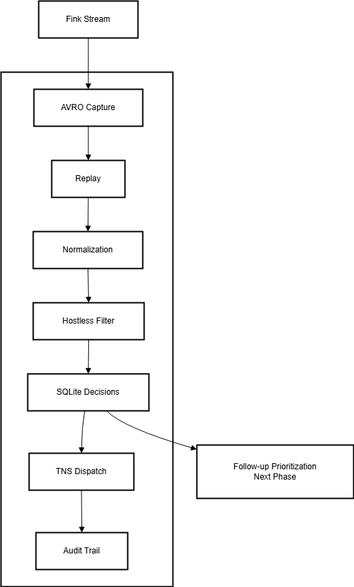

# FirstLight

**FirstLight** is a low-latency, auditable transient triage pipeline built on public alert streams to identify, report, and prioritize high-value **hostless** candidates for follow-up.

## Current Status

- Public repository sanitized and aligned with the production workflow.
- First successful **production** TNS report achieved.
- Nightly capped reporting validated.
- Next milestone: follow-up prioritization within the hostless niche for independent classification.

## Project Scope

The public focus of the project is:

- Real-time ingestion of public Fink/ZTF alerts.
- Normalization and niche filtering for hostless candidates.
- Anti-duplication and TNS reporting.
- SQLite-backed auditing and reproducibility.
- Transition from pure first-report automation to **follow-up prioritization**.

## Why This Project Exists

Modern public alert streams produce more transient candidates than a single observer can realistically follow.

FirstLight is not meant to maximize the number of reports. Its goal is to:

1. Identify a small number of high-value hostless candidates in real time.
2. Report them with traceability.
3. Prioritize the subset that is realistically followable and classifiable with limited independent resources.

## High-Level Architecture

FirstLight currently operates as:

`Fink alert stream -> AVRO capture -> Replay / Normalization -> Hostless niche filter -> SQLite decisions -> TNS dispatch -> Auditing`



Core design principles:

- **Low latency**
- **Auditability**
- **Replayability**
- **Small operational footprint**
- **Clear separation between discovery/reporting and follow-up prioritization**

## Repository Structure

```text
FirstLight/
  config/
    n1.example.yaml
    tns.example.env

  scripts/
    run_night.ps1
    run_night_wrapper.ps1
    replay_avro_dir.py
    morning_check.ps1
    sweep_replies_once.ps1

  src/firstlight/
    __init__.py
    __main__.py
    cli.py
    niches/
      n1_hostless_fast.py
    pipeline/
      normalize.py
    storage/
      db.py
    tns/
      client.py
      dispatch.py
    utils/
      time.py

  deploy/windows/
    task.example.xml

  legacy/
    ...older or non-production paths kept for reference only
```

## Production-Relevant Components

The current production-oriented workflow relies mainly on:

- `scripts/run_night.ps1`
- `scripts/replay_avro_dir.py`
- `scripts/morning_check.ps1`
- `src/firstlight/cli.py`
- `src/firstlight/storage/db.py`
- `src/firstlight/tns/client.py`
- `src/firstlight/tns/dispatch.py`
- `src/firstlight/pipeline/normalize.py`
- `src/firstlight/niches/n1_hostless_fast.py`

## Environment And Configuration

Two example configuration files are included:

- `config/n1.example.yaml`
- `config/tns.example.env`

Sensitive runtime files such as local databases, `.env.prod`, logs, and operational artifacts are intentionally excluded from version control.

## TNS Notes

The project supports TNS-related actions from the CLI, including:

- Environment checks
- Payload inspection
- Minimal payload printing
- Report reply polling
- Capped dispatch from the local SQLite database

Example:

```powershell
python -m firstlight --env .env.prod tns envcheck
python -m firstlight --env .env.prod tns submit-min --print-payload
```

## Nightly Operation

Typical production-oriented usage is based on the nightly runner:

```powershell
& .\scripts\run_night.ps1 `
  -MaxHours 10 `
  -EnvFile .env.prod `
  -CfgPath .\config\n1.example.yaml `
  -DbPath .\firstlight_prod.sqlite `
  -PythonExe C:\path\to\python.exe `
  -FinkConsumerExe C:\path\to\fink_consumer.exe `
  -DispatchMaxSubmit 1 `
  -DispatchSkipReply:$true
```

A quick morning review can be done with:

```powershell
.\scripts\morning_check.ps1 -Db .\firstlight_prod.sqlite
```

## Roadmap

The current roadmap is:

1. Keep the hostless discovery/reporting workflow stable.
2. Add a follow-up prioritization layer within the hostless niche.
3. Track which submitted candidates are realistically classifiable.
4. Build a small, well-documented set of follow-up outcomes.
5. Transition from reporting infrastructure to a scientifically defensible follow-up selection story.

## What This Repository Is Not

This is **not** a polished general-purpose astronomy platform, and it is **not yet** a full automated classification system.

It is an independent, evolving project focused on:

- Operational reliability
- Transparent candidate selection
- Realistic progression toward classification-oriented follow-up

## Personal Context

FirstLight is a fully independent personal project developed out of a long-standing interest in astrophysics and time-domain astronomy.

It is being developed alongside part-time physics studies and focuses on the intersection of:

- Software engineering
- Real-time data pipelines
- Practical transient selection and follow-up strategy

## Publication Path

A formal publication path will only make sense once the follow-up prioritization layer is frozen and evaluated on real cases with documented outcomes.

Until then, the repository should be read as:

- A real working system
- With a validated first production stage
- And with a clearly defined next scientific stage
